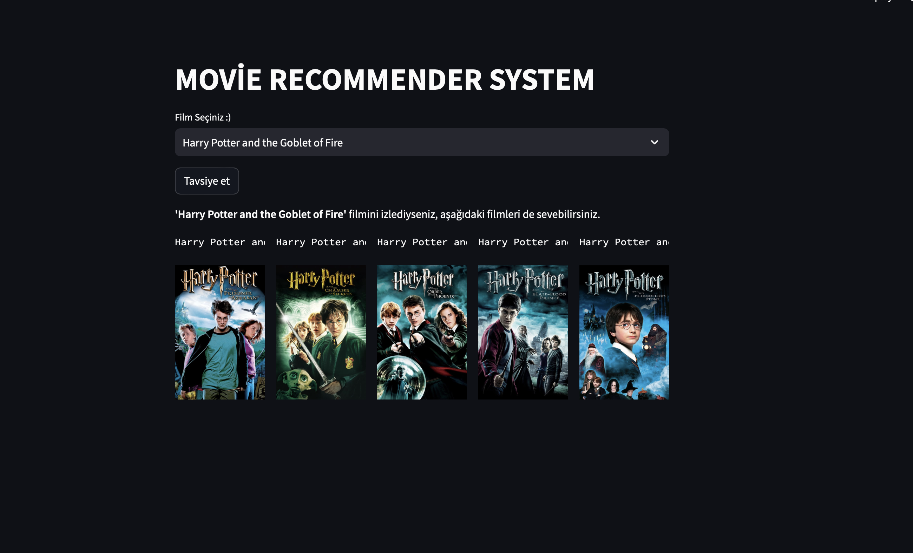

# NLP_Project_Recommender_System

Movie_Recommender_Model and Deploying with Streamlit 

Bu proje, kullanıcılara izledikleri filmlere dayalı olarak diğer filmleri tavsiye etmek için bir öneri sistemi oluşturmayı amaçlamaktadır.

## Proje Hakkında

- **Proje Adı**: Film Tavsiye Sistemi
- **Proje Türü**: Kişisel 

## Amaç

1. Kullanıcıların izledikleri filmlere dayalı olarak diğer filmleri tavsiye etmek.
2. Python ve Streamlit kullanarak interaktif bir web uygulaması oluşturmak.
3. TMDb API ve film verilerini kullanarak veri analizi yapmak.

## Nasıl Çalışır?

- Kullanıcılar web uygulamasına giderek sevdikleri bir filmi seçerler.
- Proje, seçilen filmle benzer özelliklere sahip diğer filmleri analiz eder.
- Sonuç olarak, kullanıcılara ilgilerini çekebilecek diğer filmleri tavsiye eder.

## Teknolojiler ve Kütüphaneler

- Python 3.x
- [Streamlit](https://streamlit.io/)
- [pandas](https://pandas.pydata.org/)
- [numpy](https://numpy.org/)
- [scikit-learn](https://scikit-learn.org/)
- [TMDb API](https://www.themoviedb.org/documentation/api)
 
- Dataset link : https://www.kaggle.com/datasets/tmdb/tmdb-movie-metadata
- NLP ve streamlit kullanarak tavsiye sistemi oluşturuldu, end_to_end NLP projesi örneğidir.
- Kodlara açıklamalar yorum olarak eklenmiştir.
- TMDb API'sine bir GET isteği yapmak için bir ID kullanılır.
- ID https://www.themoviedb.org/settings/api sitesinden alınmıştır
- API isteği yapmak için kullanılan URL, belirli bir film ID'si ile oluşturulur. API'ye erişim sağlamak için API anahtarını (api_key) içeren URL kullanılır.
- requests.get(url) ile oluşturulan URL'ye bir GET isteği gönderilir ve API'den veri alınır.
- data.json() ile alınan veri JSON formatından Python sözlüğüne dönüştürülür.
- Veriden film posterinin dosya yoluna erişilir ve poster_path adında bir değişkene atanır. Bu dosya yolunun örneği şöyle görünebilir: -- /abc123xyz.jpg

